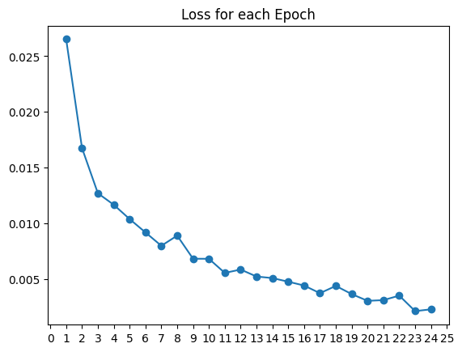

# Live Loss

Live Loss is a small utility used to create a live, inline loss plot when training a model in a Jupyter Notebook. 

## Usage

```python
from liveloss import LiveLoss
l = LiveLoss()
```
Each time a new loss is calculated:
```python
l.send(epoch+1, running_loss / len(train_set))
```

You can see a working example in [example.ipynb](example.ipynb)



## Credit
Credit where credit is due, this project was inspired by [this repo](https://github.com/stared/livelossplot).